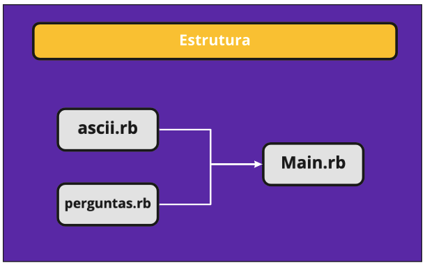
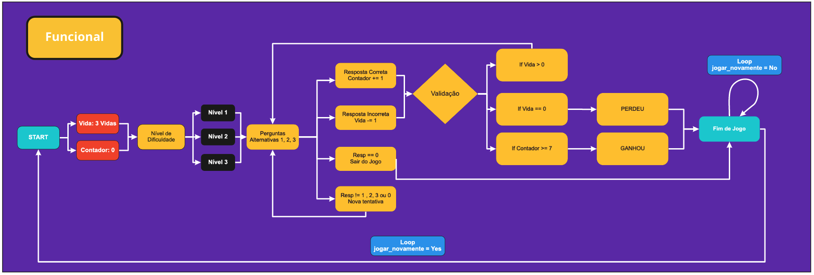

# Show do Bzao - Jogo de perguntas e respontas
## Estrutura dos arquivos

<div align="center">
     
</div>

##  Fluxo do jogo
<div align="center">
     
</div>

## Sobre o jogo
### Jogo de pergunta sobre conhecimentos gerais e respostas com 3 possibilidades de níveis:
- Fácil
- Intermediário
- Difícil

## Se precisar fazer um git clone, utilize:
- HTTPS
```bash
https://github.com/gabrielyuto/show_do_bezao.git
```
- SSH
```bash
git@github.com:gabrielyuto/show_do_bezao.git
```
### 🛠 Tecnologia utilizada:
- Ruby

### Desenvolvido por:
- @gabrielyuto
- @jaquelineborba
- @kariane 
- @MariaFalcao

## Acesso ao Miro: [Aqui!](https://miro.com/app/board/o9J_l5jOEQ0=/)

